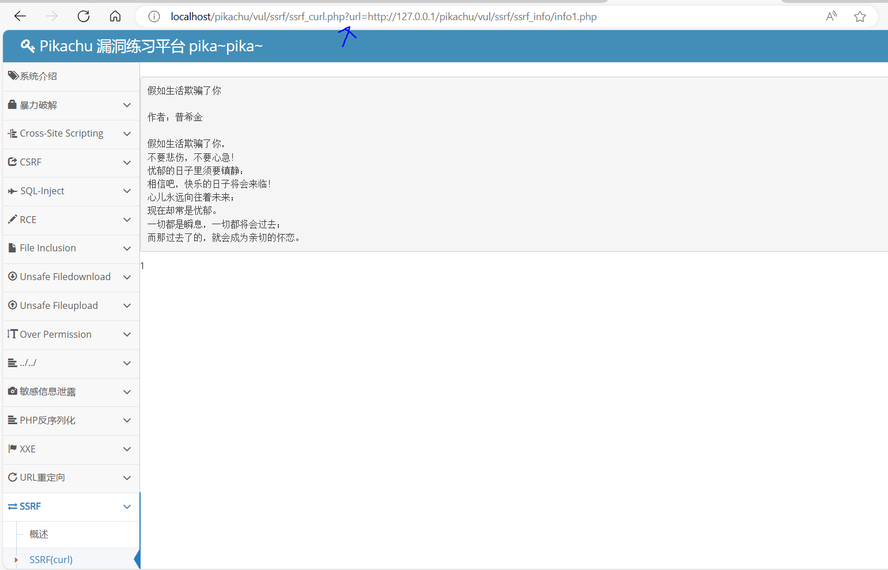
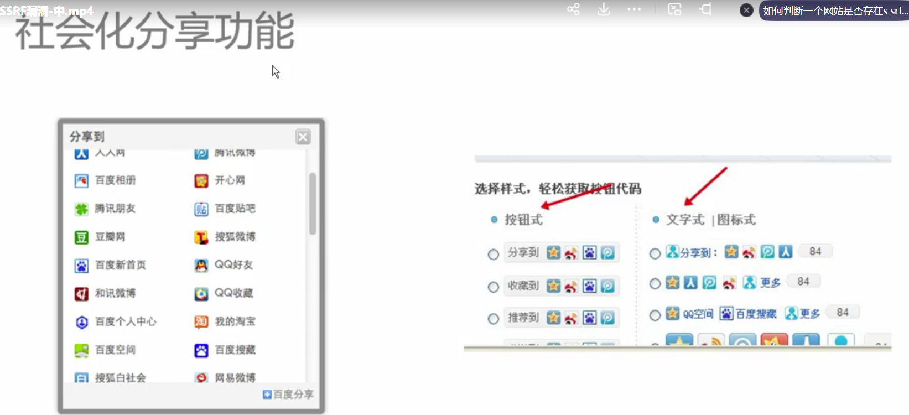

# SSRF渗透与防御	

## 什么是ssrf?

	

ssrf的危害


php的curl扩展，一般需要在php.ini配置文件下查看是否被注释掉。

	

php也有其他函数可能使得产生ssrf漏洞。

	

curl也支持其他的协议，比如从攻击的角度来看，dict协议可以用于探测端口

	

但实际上dict协议是用于搭建在线字典服务

	

### ssrf示例演示

首先为了保证实验成功，必须在php.ini配置文件确保没有注释extension=php_curl.dll

把提供的php文件放入到ssrf目录下，然后在phpstudy创建网站即可。

	

解读ssrf1.php这段源代码，主要就是通过get请求获取url并通过游览器去访问。

```php
<?php
function curl($url){  
    // 初始化curl会话
    $ch = curl_init();
    // 设置URL和相应的选项
    //给这个会话设置url为get函数传递的url
    curl_setopt($ch, CURLOPT_URL, $url);
    curl_setopt($ch, CURLOPT_HEADER, 0); // 禁止把头文件的信息作为数据流输出  
    // 抓取URL并把它传递给浏览器  
    curl_exec($ch);
    //关闭cURL资源，并且释放系统资源  
    curl_close($ch);
}

$url = $_GET['url'];
curl($url);  
?>
```

比如传递百度的url就可以跳转到百度。

	

此时也就发现了ssrf漏洞，因为curl也支持文件协议，那么就可以访问本地敏感文件。

	

由于curl支持dict协议，那么也可用来检测服务器端口。

比如检测到有3306端口开放，但是如果是3307则无法加载出来。

	

### pikachu演示

首先点击ssrf的链接，发现是通过url参数进行传递。

	

于是利用这个漏洞进行端口检测，比如3306

	

比如访问敏感文件host

	

如果要访问敏感文件是php代码,则需要使用php伪协议访问，当然结果是base64编码，需要进行解码，php文件是不能直接通过file协议访问内容的。

这里使用的pikachu第二个ssrf靶场，其中点击链接是通过file进行传参。

	

在base64编码的内容进行解码，即可获得源代码。


## ssrf的常见场景

比如分享功能，要分享到其它网站，则需要解析其他网站的地址，但是如果把解析的内容换成服务器的敏感文件，即可获取敏感信息。

	

转码主要是为了解决页面显示尺寸奇怪的情况，转码会加载本地服务器的文件，如果此时改为加载敏感文件，将会形成攻击漏洞。

	

在线翻译，可能会解析本页面的英文，从而翻译为中文，如果把解析的内容换成敏感文件，同样可攻击。

	

图片加载上传，如果提供图片链接，那么就会进行解析，也可拿来解析服务器的本地敏感文件

	

	

	

其中cms系统也有过ssrf的漏洞。

	

## 如何检测是否有ssrf漏洞?

	

## 如何防御ssrf漏洞?

比如禁止使用file协议去访问服务器本地文件

	

```
总结:
ssrf的漏洞往往需注意源代码有curl_exec函数、file_get_contents函数、fsockopen函数。
只要有服务器访问其他网站链接或者访问本地服务器的文件，并且暴露传递的参数，那么就可以用作为ssrf漏洞

防御手段如上图所示。

```


